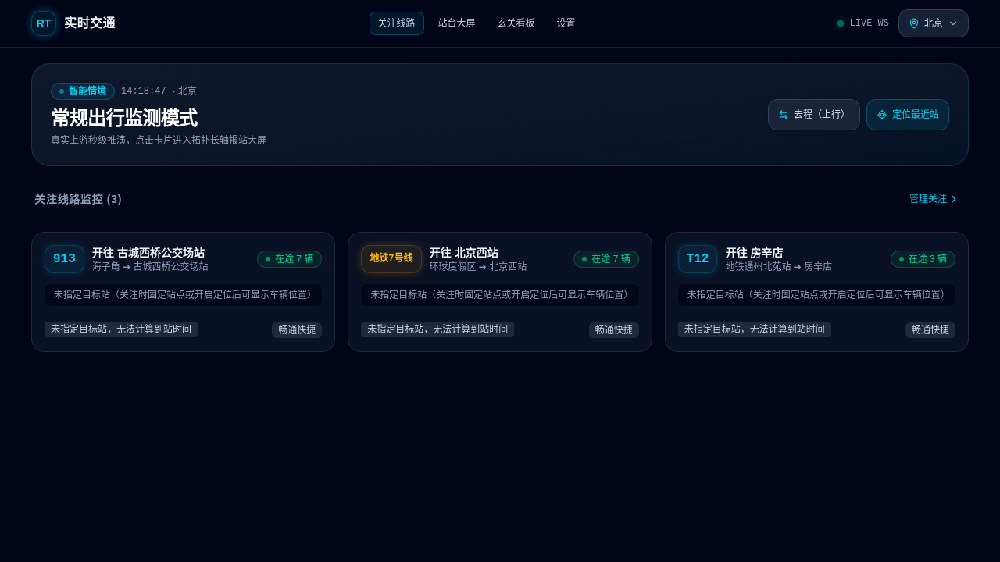
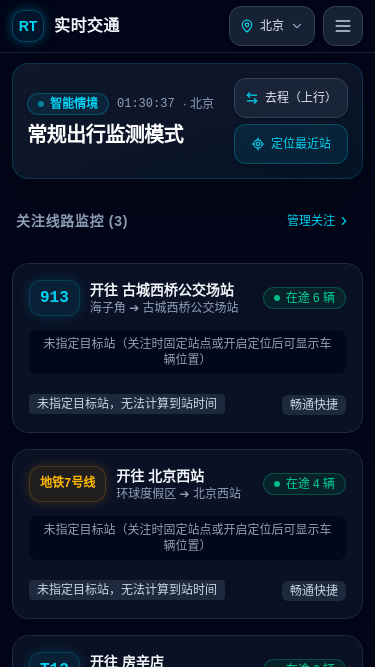
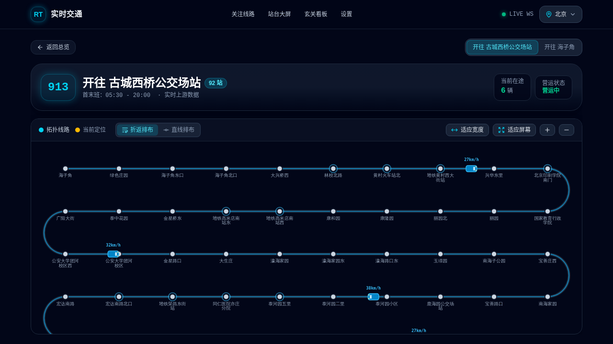
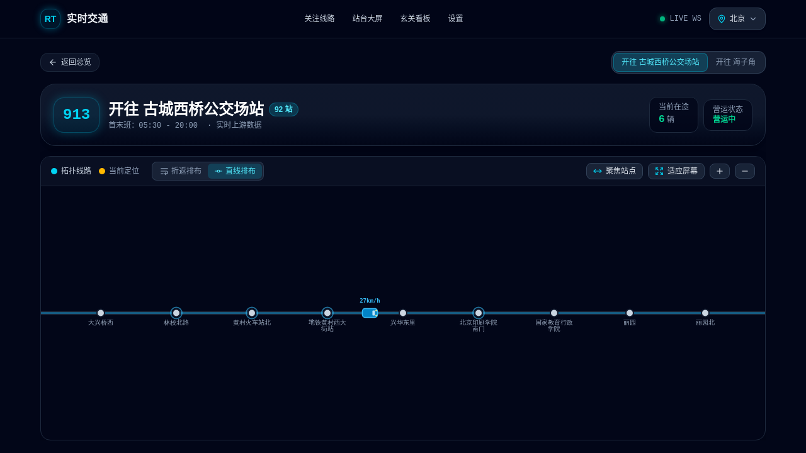
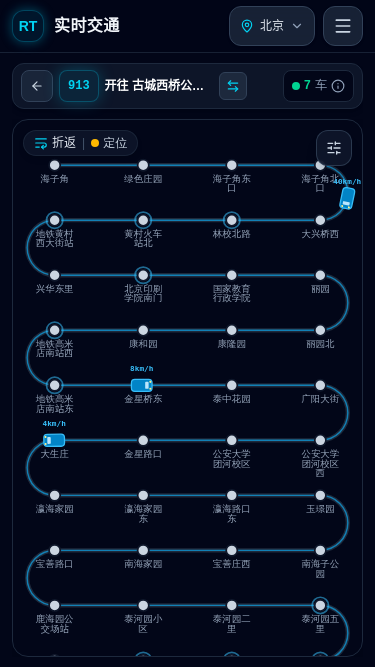
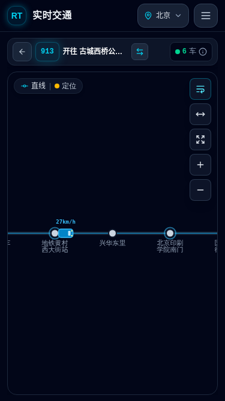
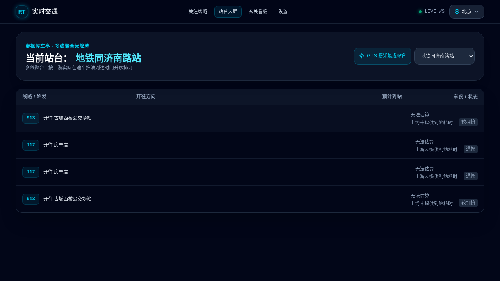
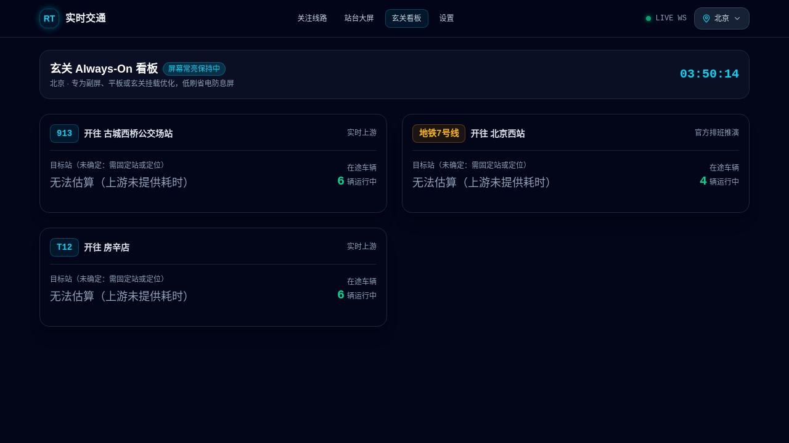

# 实时交通

移动端优先的高密度实时公交与地铁可视化系统。专注于纯粹的拓扑线路长轴与经典的**多行折返 / 直线报站屏**，去除繁重的商业地图底图，在 1 秒内为通勤者提供关键决策信息（“车在哪里、还有多久到、要不要跑向车站”）。

> 开源即用、可插拔数据源、多城市覆盖。默认聚焦北京，亦支持上海、广州、深圳等全国 500+ 城市。

---

## 核心特性

- **纯粹拓扑 · 折返与直线站牌（Route Board）**：针对 40~90 站的超长线路，支持按屏宽自适应分行折返排布（左右边缘通过平滑 180° 贝塞尔圆弧 U-Turn 衔接），亦可随时一键切换为连续直线贯通单轴长卷，单屏尽览全貌。
- **拟物科技动效（Konva.js 2D Canvas，三层动静分离）**：
  - **航位推算平滑插值（Dead Reckoning）**：消除 15~30 秒数据轮询带来的瞬移，车辆靠站减速、出站加速。
  - **弯道平滑切向转向**：车辆行驶至 U-Turn 弯道时，车身随圆弧曲率自动平滑旋转姿态。
  - **最近站点呼吸光晕**：结合定位自动计算最近车站，呈现金色脉冲波纹与到站倒计时。
  - 静态轨道层与站点层关闭事件监听且只绘制一次，帧循环仅重绘动态车辆层，移动端稳定 60FPS。
- **响应式站点疏密自适应**：移动端每行舒适展示 4~5 站，站名纵向排布清晰无遮挡；桌面宽屏保持 10~12 站高密度大屏质感。
- **多城市切换（Multi-City）**：内置全国 500+ 城市公共交通字典与地铁网络，顶栏一键切换；关注线路、站台、看板均按城市隔离。
- **可插拔数据源与故障容灾**（多源聚合，上游失效自动平滑降级）：
  - **实时公交聚合引擎**：秒级在途车辆、车速（m/s）、拥挤度全量解析。
  - **备用数据热备**：多通道数据源互备，终点站与方向智能校准。
  - **通用地铁排班推演引擎**：基于静态站序、首末班与分时段发车间隔（Headway），对任意城市地铁线路做确定性运行图推演。
  - **关键枢纽站精确时刻表**：支持分钟级官方时刻表覆写校准，调休工作日智能识别运行图，直接给出确定性到站时刻。
- **GIS 赶车决策引擎**（由后端服务统一代理与计算，安全隔离第三方凭据）：
  - **真实步行赶车决策**：计算真实路网步行耗时，与车辆到站时刻智能比对，输出「从容 / 快走 / 赶不上」三态决策。
  - **周边站台雷达**：扫描周边 800m 公交与地铁站点，站台大屏一键定位对齐。
  - **逆地理编码**：实时 GPS 坐标解析为可读地标。
- **多样化使用场景**：
  - **首页动态关注流**：微缩动态轨道（Sparkline）与到站大字号看板。
  - **虚拟候车亭（站台起降大屏）**：聚合经过当前站台的所有线路，按到站先后实时重排（“谁先来坐谁”）。
  - **玄关 Always-On 看板**：支持横屏与 Web Wake Lock 防息屏，适合淘汰平板或旧手机桌面常亮展示。
  - **智能情境感知**：自动根据早晚高峰时间切换上下行方向与目标车站。

---

## 界面预览

### 1. 首页动态关注流

| 桌面端看板 | 移动端视图 |
| :---: | :---: |
|  |  |

### 2. 线路拓扑大屏

| 经典折返排布 | 单轴贯通直线排布 |
| :---: | :---: |
|  |  |

| 移动端折返排布 | 移动端直线排布 |
| :---: | :---: |
|  |  |

### 3. 虚拟候车亭与玄关看板

| 虚拟站台起降大屏 | 玄关态势监控看板 |
| :---: | :---: |
|  |  |

---

## 技术架构

Monorepo 标准工程分层：

```
real-time-transport/
├── packages/
│   ├── shared/                # 跨端公共契约 (Zod schema, TS 类型, DTO, 城市字典, 常量)
│   └── transit-adapter/       # 可插拔数据源与推演适配器
│       ├── providers/         #   多通道公交聚合 / 通用地铁时刻表推演引擎
│       ├── services/          #   GIS 决策服务 / 枢纽站精确时刻表服务
│       └── coords.ts          #   WGS-84 ↔ GCJ-02 坐标转换
└── apps/
    ├── web/                   # 前端应用 (Vue 3, Vite 8, Tailwind CSS 4, Pinia 4, Konva 10)
    └── server/                # 后端服务 (Node 22, Fastify 5, WebSockets, PostgreSQL 18)
```

- **Node.js**: `>=22`
- **Package Manager**: `pnpm`
- **前端栈**: Vue 3 (Composition API) + Vite 8 + Tailwind CSS 4 + Pinia 4 + Konva 10 + vue-konva + vue-router 5
- **服务端栈**: Node 22 + Fastify 5 + `@fastify/websocket` + PostgreSQL 18 + Zod + Pino

### 数据源可插拔设计

所有数据源实现统一的 `ITransitProvider` 契约（`searchLines` / `getLineDetail` / `getLiveStatus` / `isAvailable`），由 `TransitAggregator` 按注册顺序聚合：任一 provider 抛错或返回 `null` 都会被静默跳过并降级到下一个，因此某个接口波动时可无缝切换。新增数据源只需实现该接口并注册进 providers 数组，UI 展现层完全复用。

---

## 快速开始

### 1. 安装依赖

```bash
pnpm install
```

### 2. 配置环境变量（根目录单一权威源）

复制 `.env.example` 为 `.env` 并按需填写：

```bash
cp .env.example .env
```

关键环境变量说明：

| 变量 | 说明 |
|---|---|
| `AMAP_MAPS_API_KEY` | 地理信息 Web 服务 API Key（REST API），用于地铁静态骨架、步行规划、周边站台与逆地理编码。缺失时相关功能自动优雅降级。 |
| `DATABASE_URL` | PostgreSQL 连接串（docker-compose 默认暴露 5432）。无数据库时自动回退到内存存储。 |
| `APIZERO_KEY` | 备用数据源 API Key（可选）。 |
| `PORT` / `VITE_PORT` | 后端 / 前端端口（默认 3000 / 5173）。 |
| `VITE_HOST` | 前端绑定地址（默认 `127.0.0.1`，如需手机真机调试可配为 `0.0.0.0`）。 |

> 采用「模式一」单一权威源：根目录 `.env` 为唯一来源，服务端经 `--env-file=../../.env` 读取，前端经 Vite `envDir` 读取。`apps/*` 下不再放置独立 `.env`。

### 3. 启动数据库与开发环境

```bash
# 启动 PostgreSQL 18 容器
docker compose up -d

# 同时启动后端 Fastify 服务与前端 Vite 开发服务器
pnpm dev
```

浏览器访问 `http://localhost:5173` 即可体验。

### 4. 代码检查与测试

```bash
pnpm code-check   # 类型检查 + ESLint（严格 0 warning 0 error）
pnpm test         # 全仓库单元测试（Vitest）
pnpm build        # 生产环境编译构建
```

---

## 主要 API

| 方法 | 路径 | 说明 |
|---|---|---|
| GET | `/api/transit/cities` | 全国城市公共交通字典 |
| GET | `/api/transit/lines/search?keyword=&cityCode=` | 跨数据源线路搜索 |
| GET | `/api/transit/lines/:lineId?direction=&cityCode=` | 线路详情（站序，DB 静态缓存） |
| GET | `/api/transit/lines/:lineId/live?direction=&cityCode=` | 实时在途车辆 |
| GET | `/api/transit/lines/:lineId/stations/:name/arrivals` | 站点到站时刻（精确表优先，否则推演） |
| GET | `/api/transit/gis/walk-decision` | 真实路网步行赶车决策 |
| GET | `/api/transit/gis/nearby-stations` | 周边站台雷达 |
| GET | `/api/transit/gis/regeo` | 逆地理编码 |
| GET/POST/DELETE | `/api/transit/favorites` | 关注线路增删查 |
| WS | `/ws` | 线路订阅实时推送（`subscribe` / `unsubscribe` / `ping`） |

---

## 许可证

MIT License
